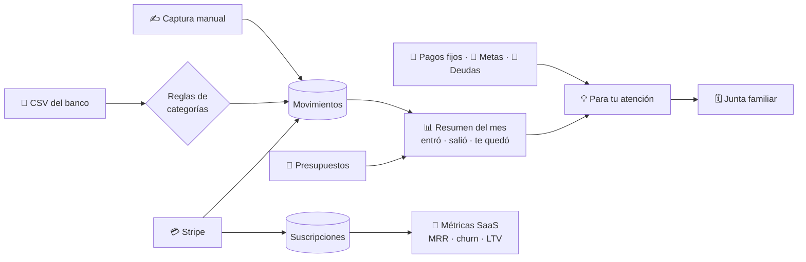
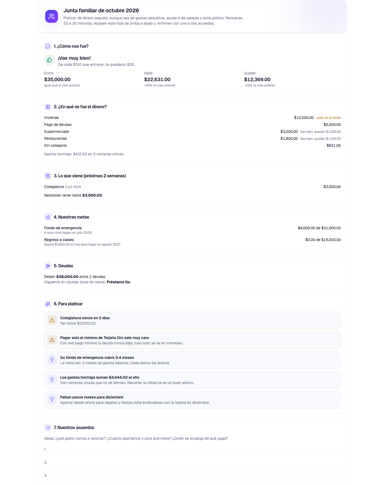
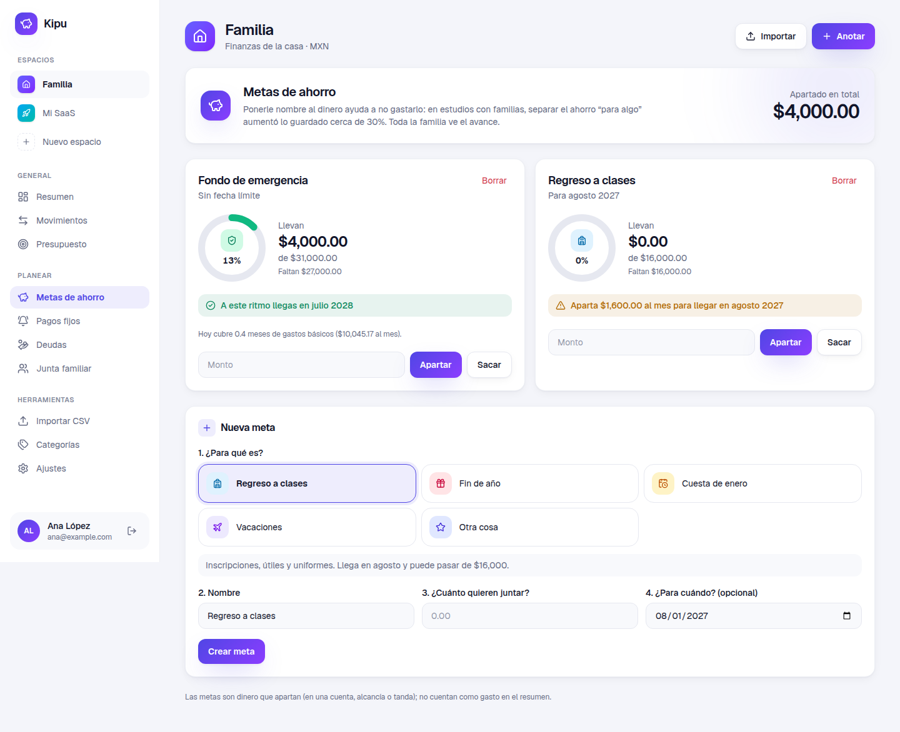
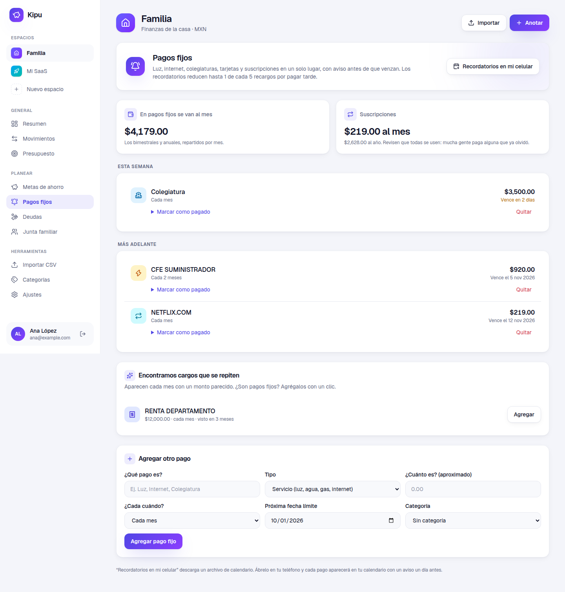
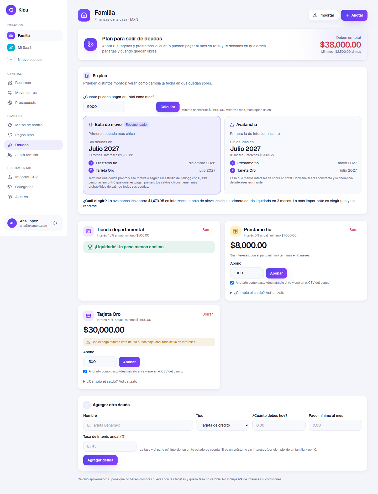
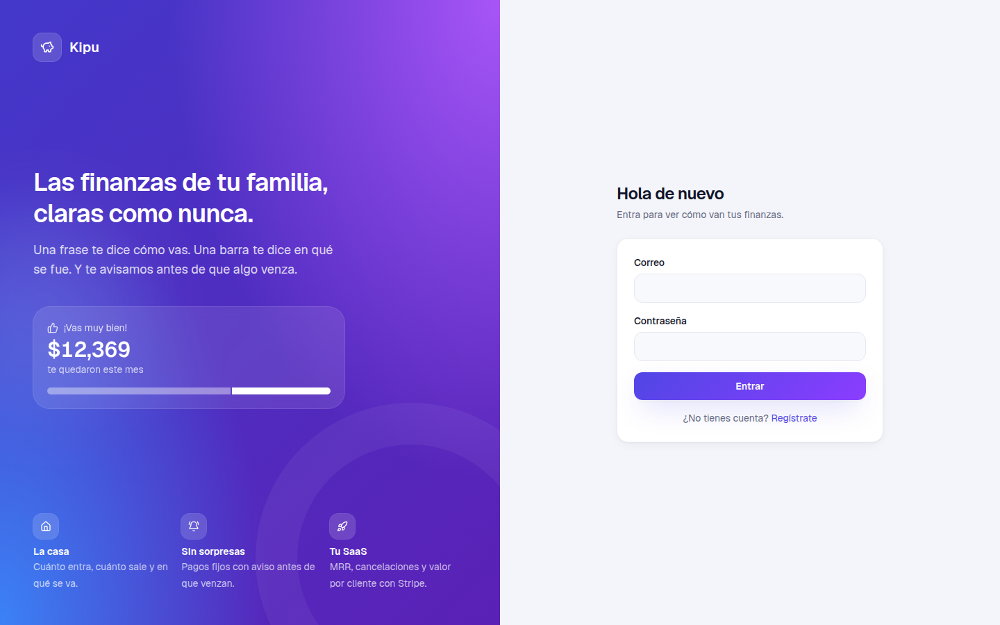

# Kipu

**Las finanzas de tu familia y de tu SaaS, en un solo lugar y fáciles de entender.**

Kipu te dice en una frase cómo va tu mes (“¡Vas muy bien! De cada $100 que entraron te quedaron $49”), en qué se fue el dinero y, para tu negocio, cuánto te pagan cada mes tus clientes y cuántos se van.


## ¿Qué puedes hacer?

| | |
|---|---|
| 🏠 **Casa y negocio por separado** | Cada uno con su moneda, sus categorías y sus miembros. |
| ✍️ **Anotar gastos e ingresos** | A mano, en segundos. |
| 🏦 **Subir el CSV del banco** | Detecta las columnas solo y no duplica nada si lo subes dos veces. |
| 🏷️ **Clasificar en automático** | Reglas como “si dice *walmart* → Supermercado”. |
| 🎯 **Presupuesto por categoría** | Un tope al mes con una barra que se llena y te avisa si vas gastando muy rápido. |
| 🐷 **Metas de ahorro** | Fondo de emergencia, regreso a clases, fin de año, cuesta de enero… con cuánto apartar al mes. |
| 🔔 **Pagos fijos** | Luz, internet, colegiaturas y suscripciones con aviso antes de que venzan, también en el calendario del celular. |
| 🤝 **Plan para salir de deudas** | En qué orden pagar (bola de nieve o avalancha) y en qué mes quedan libres. |
| ☕ **Gastos hormiga** | Las compras chicas que no se sienten, y cuánto suman al año. |
| ⚖️ **Necesidades, gustos y ahorro** | La regla 50/30/20 en una barra, para ver si algo está desbalanceado. |
| 💡 **Para tu atención** | Consejos del mes: pagos por vencer, presupuestos rebasados, temporadas como la cuesta de enero. |
| 🗓️ **Junta familiar** | Una hoja del mes para platicar de dinero 20–30 minutos e imprimir, con espacio para acuerdos. |
| 💳 **Conectar Stripe** | Ingreso mensual (MRR), cancelaciones (churn) y valor por cliente (LTV). |
| 👨‍👩‍👧 **Compartir con tu familia** | Invitas con un enlace; cada quien tiene su cuenta. |

## ¿Cómo funciona?



1. **Entra el dinero** de tres formas: lo anotas, subes el CSV del banco o lo trae Stripe.
2. **Se clasifica** con tus reglas (o lo eliges tú con un clic).
3. **Lo ves explicado**: una frase de cómo vas, una barra con cuánto gastaste y cuánto te quedó, y en qué categorías se fue.

## Herramientas para la familia (y por qué existen)

Cada función sale de una recomendación oficial o de un estudio, explicada sin tecnicismos dentro de la app:

| Función | En qué se basa |
|---|---|
| 🐷 **Metas de ahorro** | Ponerle nombre al ahorro (“para la escuela”, “para emergencias”) aumentó lo guardado alrededor de 30% en estudios de campo, y compartir las metas con otros lo aumentó 35%. CONDUSEF recomienda un fondo de emergencia de 3 a 6 meses de gastos básicos; Kipu calcula cuánto es para tu familia. |
| 🔔 **Pagos fijos** | Los recordatorios de pago redujeron en 1 de cada 5 los recargos por pagar tarde. La gente subestima lo que paga en suscripciones (unos 133 dólares al mes en EE. UU.), así que Kipu detecta cargos que se repiten y suma cuánto cuestan al año. |
| 🤝 **Deudas** | Un estudio de Kellogg con 6,000 personas encontró que pagar primero las deudas chicas (bola de nieve) hace que más gente termine de pagar. CONDUSEF advierte que el pago mínimo debe ser solo para emergencias; Kipu te dice cuánto tardarías y cuánto interés pagarías con él. |
| ☕ **Gastos hormiga** | CONDUSEF recomienda identificar estos gastos chicos y recurrentes para generar ahorro. |
| ⚖️ **50/30/20** | La guía de Elizabeth Warren: 50% necesidades, 30% gustos, 20% ahorro y deudas. Distinguir necesidades de gustos es la discusión de dinero más común en pareja (58%). |
| 🗓️ **Junta familiar** | Las parejas que platican de gastos cotidianos reportan mejores relaciones, y 55% no aparta tiempo para hablar de dinero. |
| 💡 **Temporadas** | Aguinaldo (CONDUSEF sugiere dividirlo en gastos, deudas y ahorro), cuesta de enero (predial, tenencia, colegiaturas) y regreso a clases. |



## Pantallas

| Tu SaaS en números | Movimientos |
|---|---|
|  |  |

| Metas de ahorro | Pagos fijos |
|---|---|
|  |  |

| Plan para salir de deudas | Presupuesto |
|---|---|
|  |  |

| Importar CSV | Inicio de sesión |
|---|---|
|  |  |

| En el celular |
|---|
|  |

## Glosario sin rodeos

| Término | Qué significa |
|---|---|
| **Te quedó / Ganancia** | Lo que entró menos lo que salió en el mes. |
| **Tasa de ahorro** | De cada $100 que entran, cuánto te queda. Una meta común es $20 o más. |
| **Presupuesto** | Lo máximo que quieres gastar al mes en una categoría. La rayita en la barra marca el día de hoy: si la barra la pasa, vas gastando más rápido que el mes. |
| **Fondo de emergencia** | Dinero apartado solo para imprevistos (doctor, reparaciones, quedarte sin trabajo). La meta: 3 a 6 meses de gastos básicos. |
| **Gastos hormiga** | Compras chicas y frecuentes (café, antojos, la tiendita) que no se sienten pero suman mucho al año. |
| **Regla 50/30/20** | Una guía: 50% de lo que entra para necesidades, 30% para gustos y 20% para ahorro o deudas. |
| **Bola de nieve** | Pagar primero la deuda más chica; al terminarla, lo que pagabas pasa a la siguiente. Motiva más. |
| **Avalancha** | Pagar primero la deuda con el interés más alto. Es la que menos intereses cobra en total. |
| **Pago para no generar intereses** | Lo que hay que pagar de la tarjeta para que no te cobren intereses. El pago mínimo es mucho menor, pero la deuda casi no baja. |
| **MRR** | Lo que te pagan cada mes todas tus suscripciones activas. |
| **ARR** | El MRR por 12: lo que ganarías en un año a este ritmo. |
| **ARPU** | Lo que paga en promedio cada cliente al mes. |
| **Churn** | Qué porcentaje de tus clientes canceló en los últimos 30 días. Mientras más bajo, mejor. |
| **LTV** | Lo que te deja un cliente desde que entra hasta que se va. |

Dentro de la app, cada número tiene un botón **?** con esta misma explicación.

## Empezar

Requiere Node.js 20.9 o superior.

```bash
npm install
cp .env.example .env.local   # y pon un SESSION_SECRET (openssl rand -base64 48)
npm run dev
```

Abre http://localhost:3200 y crea tu cuenta. Se crean automáticamente los espacios **Familia** y **Mi SaaS**, con una guía de **primeros pasos**.

Los datos se guardan en SQLite en `data/kipu.db` (cambia la ruta con `DATABASE_PATH`). Las migraciones se aplican solas al arrancar. **Respalda ese archivo**: es toda tu información.

## Importar CSV del banco

1. Descarga el estado de cuenta en CSV desde tu banco.
2. En el espacio, ve a **Importar CSV** y elige el archivo.
3. Revisa qué columna es la fecha, la descripción y el monto (o cargos y abonos). Kipu intenta adivinarlo.
4. Importa. Puedes volver a subir el mismo archivo: los movimientos repetidos se omiten.

En **Categorías** puedes crear reglas como “si la descripción contiene *walmart* → Supermercado”, que se aplican al importar.

## Conectar Stripe

En Stripe crea una **llave restringida** con permiso de lectura para *Subscriptions* y *Balance*, y pégala en la pestaña **Stripe** del espacio de negocio. La llave se guarda cifrada con `SESSION_SECRET` (si cambias el secreto tendrás que volver a conectarla).

- Los cobros se registran como ingresos; las comisiones y los reembolsos, como gastos.
- Los depósitos de Stripe a tu banco (payouts) se ignoran. Si también importas el CSV de la cuenta bancaria del negocio, borra esos depósitos para no contarlos dos veces.
- El MRR histórico se reconstruye con el precio actual de cada suscripción y no considera descuentos.

## Desarrollo

```bash
npm test            # pruebas unitarias (vitest)
npm run lint
npm run typecheck
npm run build
npm run db:generate # tras cambiar src/db/schema.ts, genera la migración
```

Estructura:

- `src/db/` — esquema (Drizzle) y conexión a SQLite.
- `src/lib/` — lógica: CSV, montos, métricas, Stripe, sesión.
- `src/app/actions.ts` — todas las mutaciones (server actions), cada una valida que el usuario sea miembro del espacio.
- `src/app/(auth)/` — inicio de sesión, registro e invitaciones.
- `src/app/(app)/` — páginas autenticadas.

## Producción

Cualquier servidor con Node y disco persistente sirve (VPS, Railway o Fly.io con un volumen). Plataformas sin disco persistente, como Vercel, no funcionan con SQLite.

```bash
npm run build
SESSION_SECRET=... npm start
```

## Fuentes

- CONDUSEF: [fondo de emergencia de 3 a 6 meses](https://www.elimparcial.com/dinero/2026/07/27/solo-2-de-cada-10-mexicanos-pueden-cubrir-un-gasto-inesperado-debido-a-la-falta-de-ahorro-y-la-condusef-emite-tres-recomendaciones-para-proteger-el-bolsillo/), [plan familiar de gastos](https://www.unotv.com/negocios/10-tips-de-condusef-para-armar-un-plan-familiar-de-gastos/), [pago mínimo vs. para no generar intereses](https://www.elfinanciero.com.mx/mis-finanzas/2023/05/06/como-usar-la-calculadora-de-pagos-minimos-de-tarjetas-de-credito-condusef/), [aguinaldo y cuesta de enero](https://www.elimparcial.com/dinero/2025/12/20/cuesta-de-enero-lo-que-profeco-y-condusef-recomiendan-para-no-quedar-endeudado/)
- INEGI/CNBV: [Encuesta Nacional de Inclusión Financiera](https://inegi.org.mx/contenidos/saladeprensa/boletines/2022/enif/ENIF21.pdf)
- Ahorro etiquetado: [J-PAL, Malawi](https://povertyactionlab.org/media/file-research-paper/saving-multiple-financial-needs-evidence-malawi), [metas públicas en Colombia](https://cenfri.org/research-paper/public-vs-private-mental-accounts-empirical-evidence-from-savings-groups-in-colombia/)
- Recordatorios de pago: [AFM y Riverty](https://www.afm.nl/~/profmedia/files/rapporten/2024/bnpl-riverty-experiment-en.pdf), [Cadena y Schoar, MIT](https://web.mit.edu/aschoar/www/Remembering%20to%20Pay-%20Cadena%20&%20Schoar-%20April2011.pdf)
- Suscripciones olvidadas: [C+R Research vía CNBC](https://www.cnbc.com/2022/09/06/consumers-underestimate-monthly-subscription-costs-by-at-least-100.html)
- Bola de nieve: [Kellogg School of Management](https://www.kellogg.northwestern.edu/news_articles/2012/snowball-approach.aspx)
- Hablar de dinero en pareja: [Psychology Today](https://www.psychologytoday.com/us/blog/the-nonlinear-life/202312/it-actually-may-be-good-to-fight-about-money-with-family), [Fortune](https://www.fortune.com/well/article/marriage-talk-about-money-tips)
