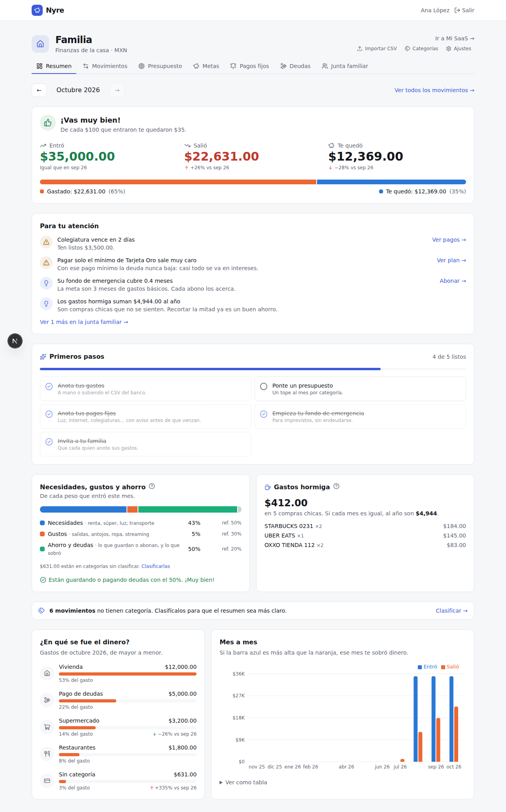
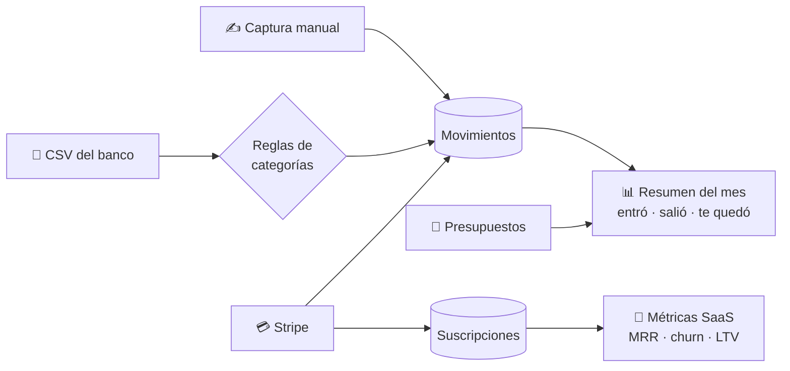
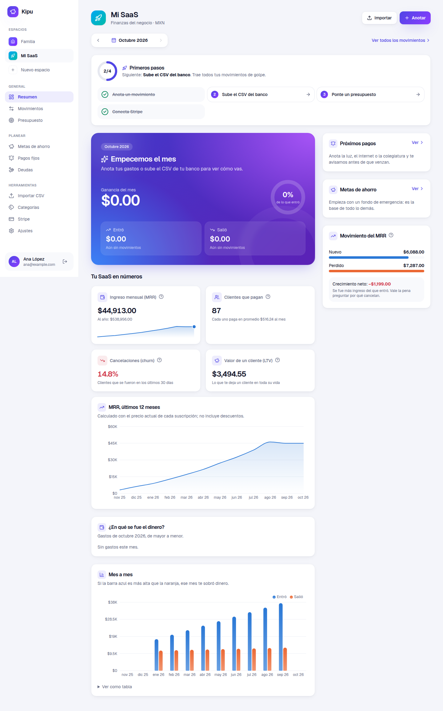
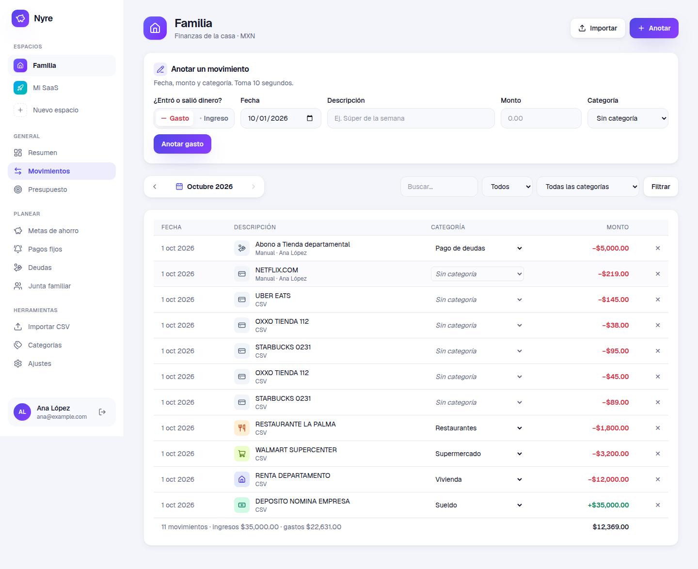
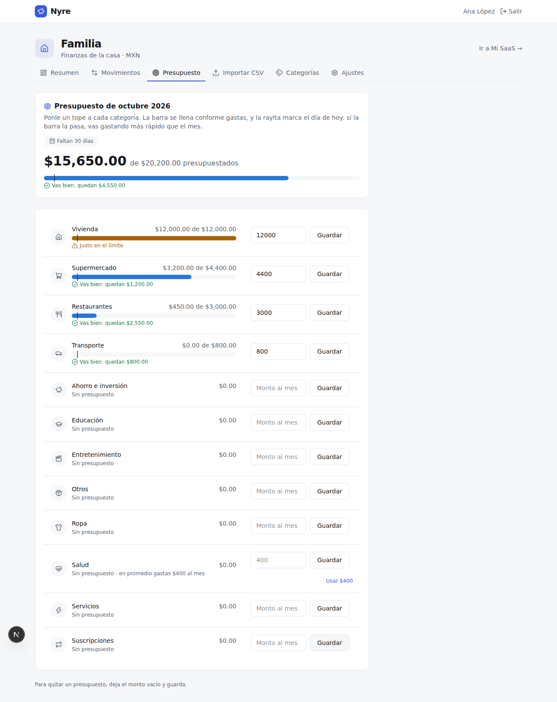
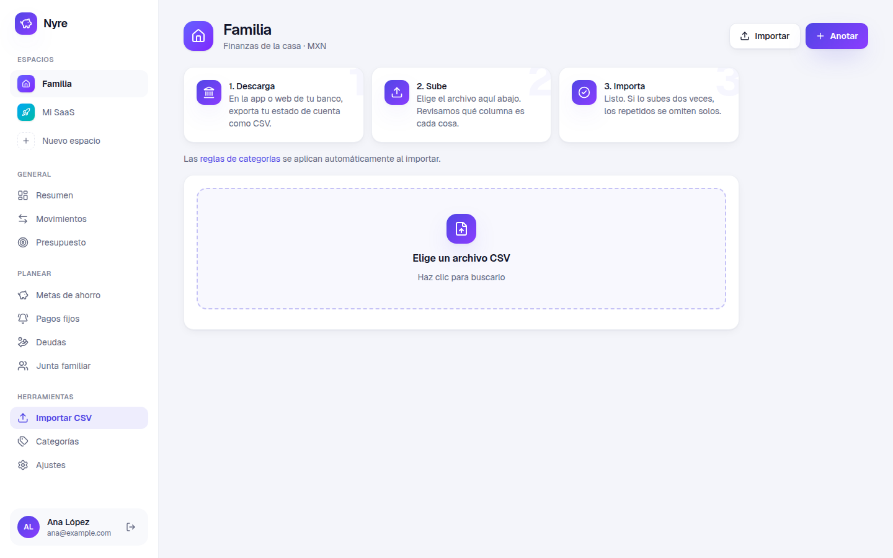
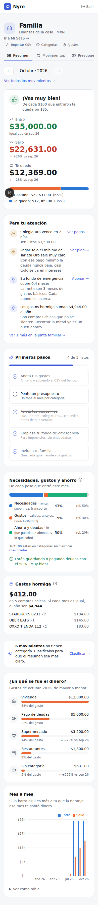

# Nyre

**Las finanzas de tu familia y de tu SaaS, en un solo lugar y fáciles de entender.**

Nyre te dice en una frase cómo va tu mes (“¡Vas muy bien! De cada $100 que entraron te quedaron $49”), en qué se fue el dinero y, para tu negocio, cuánto te pagan cada mes tus clientes y cuántos se van.



## ¿Qué puedes hacer?

| | |
|---|---|
| 🏠 **Casa y negocio por separado** | Cada uno con su moneda, sus categorías y sus miembros. |
| ✍️ **Anotar gastos e ingresos** | A mano, en segundos. |
| 🏦 **Subir el CSV del banco** | Detecta las columnas solo y no duplica nada si lo subes dos veces. |
| 🏷️ **Clasificar en automático** | Reglas como “si dice *walmart* → Supermercado”. |
| 🎯 **Presupuesto por categoría** | Un tope al mes con una barra que se llena y te avisa si vas gastando muy rápido. |
| 💳 **Conectar Stripe** | Ingreso mensual (MRR), cancelaciones (churn) y valor por cliente (LTV). |
| 👨‍👩‍👧 **Compartir con tu familia** | Invitas con un enlace; cada quien tiene su cuenta. |

## ¿Cómo funciona?



1. **Entra el dinero** de tres formas: lo anotas, subes el CSV del banco o lo trae Stripe.
2. **Se clasifica** con tus reglas (o lo eliges tú con un clic).
3. **Lo ves explicado**: una frase de cómo vas, una barra con cuánto gastaste y cuánto te quedó, y en qué categorías se fue.

## Pantallas

| Tu SaaS en números | Movimientos |
|---|---|
|  |  |

| Presupuesto | Importar CSV |
|---|---|
|  |  |

| En el celular |
|---|
|  |

## Glosario sin rodeos

| Término | Qué significa |
|---|---|
| **Te quedó / Ganancia** | Lo que entró menos lo que salió en el mes. |
| **Tasa de ahorro** | De cada $100 que entran, cuánto te queda. Una meta común es $20 o más. |
| **Presupuesto** | Lo máximo que quieres gastar al mes en una categoría. La rayita en la barra marca el día de hoy: si la barra la pasa, vas gastando más rápido que el mes. |
| **MRR** | Lo que te pagan cada mes todas tus suscripciones activas. |
| **ARR** | El MRR por 12: lo que ganarías en un año a este ritmo. |
| **ARPU** | Lo que paga en promedio cada cliente al mes. |
| **Churn** | Qué porcentaje de tus clientes canceló en los últimos 30 días. Mientras más bajo, mejor. |
| **LTV** | Lo que te deja un cliente desde que entra hasta que se va. |

Dentro de la app, cada número tiene un botón **?** con esta misma explicación.

## Empezar

Requiere Node.js 20.9 o superior.

```bash
npm install
cp .env.example .env.local   # y pon un SESSION_SECRET (openssl rand -base64 48)
npm run dev
```

Abre http://localhost:3200 y crea tu cuenta. Se crean automáticamente los espacios **Familia** y **Mi SaaS**, con una guía de **primeros pasos**.

Los datos se guardan en SQLite en `data/nyre.db` (cambia la ruta con `DATABASE_PATH`). Las migraciones se aplican solas al arrancar. **Respalda ese archivo**: es toda tu información.

## Importar CSV del banco

1. Descarga el estado de cuenta en CSV desde tu banco.
2. En el espacio, ve a **Importar CSV** y elige el archivo.
3. Revisa qué columna es la fecha, la descripción y el monto (o cargos y abonos). Nyre intenta adivinarlo.
4. Importa. Puedes volver a subir el mismo archivo: los movimientos repetidos se omiten.

En **Categorías** puedes crear reglas como “si la descripción contiene *walmart* → Supermercado”, que se aplican al importar.

## Conectar Stripe

En Stripe crea una **llave restringida** con permiso de lectura para *Subscriptions* y *Balance*, y pégala en la pestaña **Stripe** del espacio de negocio. La llave se guarda cifrada con `SESSION_SECRET` (si cambias el secreto tendrás que volver a conectarla).

- Los cobros se registran como ingresos; las comisiones y los reembolsos, como gastos.
- Los depósitos de Stripe a tu banco (payouts) se ignoran. Si también importas el CSV de la cuenta bancaria del negocio, borra esos depósitos para no contarlos dos veces.
- El MRR histórico se reconstruye con el precio actual de cada suscripción y no considera descuentos.

## Desarrollo

```bash
npm test            # pruebas unitarias (vitest)
npm run lint
npm run typecheck
npm run build
npm run db:generate # tras cambiar src/db/schema.ts, genera la migración
```

Estructura:

- `src/db/` — esquema (Drizzle) y conexión a SQLite.
- `src/lib/` — lógica: CSV, montos, métricas, Stripe, sesión.
- `src/app/actions.ts` — todas las mutaciones (server actions), cada una valida que el usuario sea miembro del espacio.
- `src/app/(auth)/` — inicio de sesión, registro e invitaciones.
- `src/app/(app)/` — páginas autenticadas.

## Producción

Cualquier servidor con Node y disco persistente sirve (VPS, Railway o Fly.io con un volumen). Plataformas sin disco persistente, como Vercel, no funcionan con SQLite.

```bash
npm run build
SESSION_SECRET=... npm start
```
